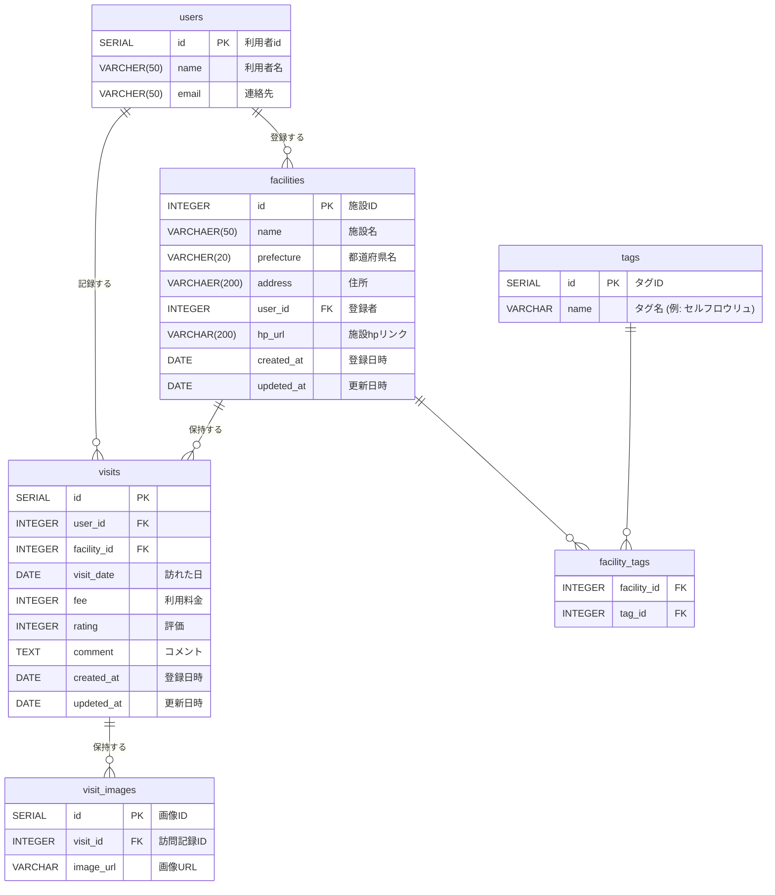

<!-- テーブル名、カラム名、データ型、制約（必須項目など） -->
## 2. テーブル定義

### 2.1 users（ユーザーテーブル）
アプリを利用するユーザー情報を管理する。

| カラム名 | データ型 | 制約 | 備考 |
| :--- | :--- | :--- | :--- |
| `id` | SERIAL | PRIMARY KEY | 自動連番 |
| `name` | VARCHAR(50) | NOT NULL | 画面表示用のユーザー名 |
| `email` | VARCHAR(50) | UNIQUE, NOT NULL | ログインおよび連絡用アドレス |

### 2.2 facilities（施設テーブル）
温泉・サウナの基本情報を管理する。ユーザーによって新規登録される。

| カラム名 | データ型 | 制約 | 備考 |
| :--- | :--- | :--- | :--- |
| `id` | SERIAL | PRIMARY KEY | 自動連番 |
| `name` | VARCHAR(50) | NOT NULL | 施設名 |
| `prefecture` | VARCHAR(20) | NOT NULL | 都道府県（検索・地図UI連動用） |
| `address` | VARCHAR(200) | | 詳細な住所 |
| `user_id` | INTEGER | FOREIGN KEY | 施設を初登録したユーザーのID |
| `hp_url` | VARCHAR(200) | UNIQUE | 施設ホームページへのリンク |
| `created_at`| TIMESTAMP | DEFAULT NOW() | 施設データの初回登録日時 |
| `updated_at`| TIMESTAMP | DEFAULT NOW() | 施設データの最終更新日時 |

### 2.3 visits（訪問記録テーブル）
ユーザーが特定の施設を訪れた際の日記・レビュー（トランザクションデータ）を管理する。

| カラム名 | データ型 | 制約 | 備考 |
| :--- | :--- | :--- | :--- |
| `id` | INTEGER | PRIMARY KEY | 自動連番 |
| `user_id` | INTEGER | FOREIGN KEY | 訪問したユーザーのID |
| `facility_id` | INTEGER | FOREIGN KEY | 訪問した施設のID |
| `visit_date`| DATE | NOT NULL | 実際に施設を訪れた日付 |
| `fee` | INTEGER | | その日支払った利用料金（円） |
| `rating` | INTEGER | NOT NULL | 1〜5段階の星評価 |
| `comment` | TEXT | | 感想・レビュー本文 |
| `created_at`| TIMESTAMP | DEFAULT NOW() | 訪問記録の初回登録日時 |
| `updated_at`| TIMESTAMP | DEFAULT NOW() | 訪問記録の最終更新日時 |

### 2.4 tags（特徴タグテーブル）
属性ラベル。ex.「サウナあり」,「露天風呂あり」

| カラム名 | データ型 | 制約 | 備考 |
| :--- | :--- | :--- | :--- |
| `id` | SERIAL | PRIMARY KEY | 自動連番 |
| `name` | VARCHAR(30) | NOT NULL | タグ名 |

### 2.5 facility_tags（施設とタグの中間テーブル）
施設とタグの「多対多（N:N）」の関係を結ぶ。

| カラム名 | データ型 | 制約 | 備考 |
| :--- | :--- | :--- | :--- |
| `facility_id` | INTEGER | FOREIGN KEY | 施設ID |
| `tag_id` | INTEGER | FOREIGN KEY | タグID |

### 2.6 visit_images（訪問画像テーブル）
1回の訪問に対して複数枚の思い出写真を保存する。

| カラム名 | データ型 | 制約 | 備考 |
| :--- | :--- | :--- | :--- |
| `id` | SERIAL | PRIMARY KEY | 画像ID |
| `visit_id` | INTEGER | FOREIGN KEY | 訪問記録ID |
| `image_url` | VARCHAR(2048) | | 思い出の画像（S3等のURLを想定） |
| `created_at` | TIMESTAMP | DEFAULT NOW() | 作成日時 |

## 3.テーブル間リレーション一覧

| 親テーブル | 子テーブル | リレーション種別 | 統合キー(FK) | 概要 |
| :--- | :--- | :--- | :--- | :--- |
| users | facilities | 1 対 多 (1:N) | facilities.user_id | 1人のユーザーは複数の施設を初回登録できる |
| users | visits | 1 対 多 (1:N) | visits.user_id | 1人のユーザーは複数の訪問記録を作成できる |
| visits | visit_images | 1 対 多 (1:N) | visit_images.visit_id | 1回の訪問記録に対して複数の画像を保存できる |
| facilities | visits | 1 対 多 (1:N) | visits.facility_id | 1つの施設は複数の訪問記録を保持する |
| facilities | facility_tags | 1 対 多 (1:N) | facility_tags.facility_id | 1つの施設は複数のタグを持てる |
| tags | facility_tags | 1 対 多 (1:N) | facility_tags.tag_id | 1つのタグは複数の施設に付けられる |

<!-- テーブル同士のリレーション（繋がり）
実務のワンポイント:
Markdown内で「Mermaid（マーメイド）」という記法を使うと、テキストで書くだけでGitHub上で綺麗なER図（テーブル関係図）が表示されるため、ポートフォリオとしても非常に見栄えが良くなります。 -->

