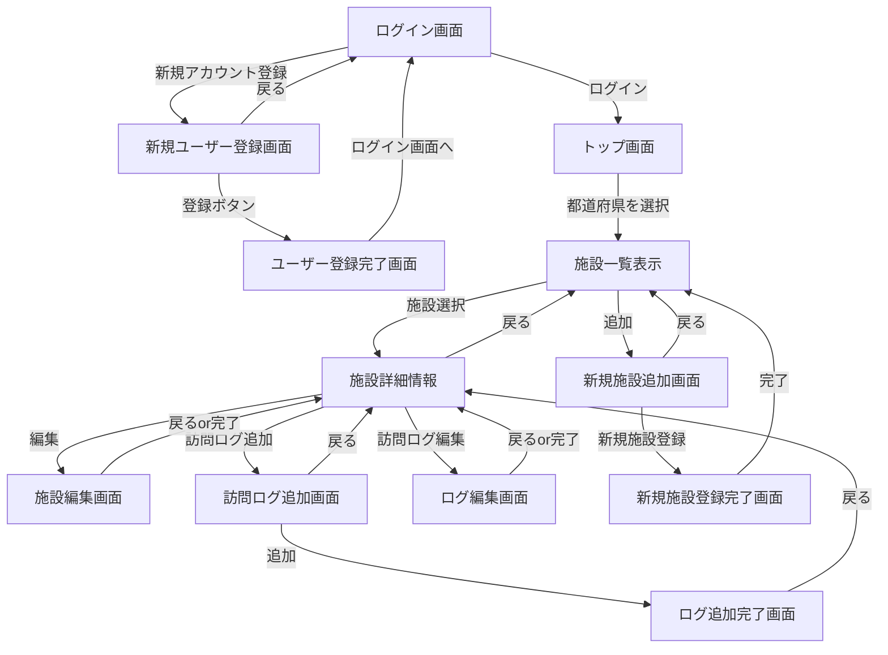

# 画面仕様書

## 画面遷移図

## 1. ログイン画面 (`/`)
ユーザーがアプリにログインするための画面です。

### 画面構成
- ユーザー名入力欄
- メールアドレス入力欄
- ログインボタン
- 新規登録画面（`/register`）へのリンク

### 機能・挙動仕様
- **新規ユーザー登録ボタン押下時:** 
  - 新規ユーザー登録画面 (`/register`)へ遷移する

- **バリデーション:**
  - ユーザー名：必須入力、50文字以下。
  - メールアドレス：必須入力、メールアドレスの形式チェック。

- **ログインボタン押下時:**
  - 認証に成功した場合：トップ画面（`/top`）へ遷移する。
  - 認証に失敗した場合：「ユーザー名またはメールアドレスが一致しません。」というエラーメッセージを画面上部に赤字で表示する。

---

## 2. 新規ユーザー登録画面 (`/register`)
ユーザーが新規アカウント登録するための画面です。

### 画面構成
- ユーザー名入力欄
- メールアドレス入力欄
- 登録ボタン
- ログイン画面(`/`)へのリンク

### 機能・挙動仕様
- **バリデーション:**
  - ユーザー名：必須入力、50文字以下。
  - メールアドレス：必須入力、メールアドレスの形式、重複チェック。
    - すでに登録済みの場合：「このメールアドレスは既に登録されています。」というエラーメッセージを表示。

- **新規登録ボタン押下時:**
    - 認証に成功した場合：登録完了画面(`/register/success`)
    - 認証に失敗した場合：「ユーザー登録処理中にエラーが発生しました。」というエラーメッセージを表示する。

- **ログイン画面に戻るボタン押下時:**
    - ログイン画面(`/`)に遷移する。

---

## 3. ユーザー登録完了画面 (`/register/success`)
ユーザーにアカウント登録完了を知らせるための画面です。

### 画面構成
- 完了を伝える文章
- ログイン画面(`/`)へのリンク

### 機能・挙動仕様
- **初期表示:**
    -  「アカウントの作成が正常に完了いたしました。続いてログイン画面よりログインを行ってください。」というメッセージの表示。

- **ログイン画面へ移動ボタンを押下時：**
    - ログイン画面(`/`)に遷移する

---

## 4. トップ画面 (`/top`)
都道府県名、各地方エリアで温泉施設を選択するための画面です。

### 画面構成
- 地方ごとに都道府県を絞り込むためのボタン
- 都道府県ごとのボタン

### 機能・挙動仕様
- **アクセス制限：**
    - urlのクエリパラメーターにuserIdが含まれていない場合、自動的にログイン画面(`/`)にリダイレクトする。

- **初期表示:**
    - 画面描画時に、prefecturesテーブルから全ての都道府県データを昇順に全県所得する。

- **コンポーネント連携:**
    - 日本地図描画のためのコンポーネント<JapanMap />に都道府県データとクエリパラメータから所得したuserIdをPropsとして受け渡す。

---

## 5. 施設一覧画面 (`/facilities`)
トップ画面で絞り込んだ、都道府県ごとの施設を一覧表示するための画面です。

### 画面構成
- 施設を一覧表示する画面
- 新規施設追加ボタン(`/facilities/new`)へのリンク
- 都道府県を選択するためのプルダウンメニュー
- 施設詳細画面(`/facilities/[id]`)へのリンク

### 機能・挙動仕様
- **アクセス制限：**
    - urlのクエリパラメーターにuserIdが含まれていない場合、自動的にログイン画面(`/`)にリダイレクトする。

- **初期表示：**
    - prefecturesテーブルから都道府県データを全件取得し,prefectureIdを指定した場合、共通するprefectureIdを持つfacilityをfacilitiesテーブルから登録日時が新しい順(desc)に表示する
    - 登録されている施設がなかった場合、「録されている施設がありません。」というメッセージを表示する。

- **新規施設追加ボタン押下時：**
    - 新規施設追加画面(`/facilities/new`)に遷移する。

- **詳細ボタンを押下時：**
    - 詳細画面(`/facilities/[id]`)に遷移する。

---

## 6.施設詳細画面 (`/facilities/[id]`)
選択された温泉施設の詳細情報を表示し、その施設に対する訪問記録を確認・投稿できる画面です。

### 画面構成
- 施設情報エリア（施設名、住所、公式HP、特徴タグデータ）
- 訪問ログ追加ボタン（`/facilities/[id]/visits/new` へのリンク）
- 編集ボタン（`/facilities/[id]/edit` へのリンク）
- 削除ボタン
- 訪問記録一覧エリア（ユーザー名、訪問日、評価、コメント、訪問画像）
- 施設一覧に戻るボタン(`/facilities`へのリンク)

### 機能・挙動仕様
- **初期表示:**
  - URLの `[id]` に紐づく施設情報をデータベースから取得して表示する。存在しないIDの場合は404画面を表示する。
  - 訪問記録一覧は、投稿日時が新しい順（降順）で表示する。

- **訪問ログ編集制限:**
  - クエリパラメーターから取得した、userIdと訪問ログで登録されているuserIdが一致している場合のみ編集ボタンを表示する。

- **削除制限：**
    - 訪問ログが一件以上(`visitCount > 0`)の場合、コンソールに「施設ID: ${facilityId} は訪問ログが ${visitCount} 件存在するため削除できません。」と出力する。
    - 訪問ログが存在する場合、削除ボタンはdisable属性で押下不可になる

- **施設一覧に戻るボタンを押下時:**
    - 施設一覧画面(`/facilities`)に遷移する。

---

## 7. 新規施設追加画面 (`/facilities/new`)
新しく施設を登録するための画面です。

### 画面構成
- 施設名を入力する欄
- 都道府県を選択するボタン
- 詳細な住所を入力する欄
- ホームページのURLを入力する欄
- 登録するボタン
- 施設一覧画面(`/facilities`)に戻るボタン

### 機能・挙動仕様
- 
- 
- 

---

## 8. 新規施設追加完了画面 (`/facilities/success`)
新規施設登録後に完了をユーザーに伝えるための画面です。

### 画面構成
- 完了を伝える文章
- 施設詳細画面(`/facilities/[id]`)に戻るボタン

### 機能・挙動仕様
- 
- 
- 

---

## 9. 施設情報編集画面 (`/facilities/[id]/edit`)
登録済みの施設情報を編集するための画面です。

### 画面構成
- 施設詳細画面(`/facilities/[id]`)に戻るボタン
- 施設名を入力する欄
- 都道府県を選択するボタン
- 詳細な住所を入力する欄
- ホームページのURLを入力する欄
- 更新するボタン

### 機能・挙動仕様
- **アクセス制限：**
    - urlのクエリパラメーターにuserIdが含まれていない場合、自動的にログイン画面(`/`)にリダイレクトする。
- 
- 

---

## 10. 訪問ログ追加画面 (`/facilities/[id]/visits/new`)
温泉施設への訪問記録を残すための登録画面です。

### 画面構成
- 施設詳細画面(`/facilities/[id]`)に戻るボタン
- 訪問日を選択するボタン
- 評価を選択するボタン(1 ~ 5)
- 利用料金を入力する欄
- コメントを入力する欄
- 画像urlを入力する欄
- 送信ボタン(`/facilities/[id]/visits/success`へのリンク)

### 機能・挙動仕様
- **初期表示：**
    - URLに `facilitieId` に紐づく施設情報をデータベースから取得する。存在しないIDの場合は404画面を表示する。
- **バリデーション:**
    - 訪問日は必須選択項目(`default = today`,`required属性`)
    - 評価(1 ~ 5)は必須項目(`default =  5`,`required属性`)
    - 利用料金は負の値を受け付けない(`min = "0"`)

- **アクセス制限：**
    - urlのクエリパラメーターにuserIdが含まれていない場合、自動的にログイン画面(`/`)にリダイレクトする。

- **保存ボタン押下時:**
    - server action(createVisit())が実行され、visitsテーブルにデータが登録される。画像urlも同時に追加した場合はvisit_imagesテーブルに登録される。

- **施設詳細に戻るボタン押下時：**
    - 施設詳細画面(`/facilities/[id]`)に遷移する

---

## 11. 訪問ログ追加完了画面 (`/facilities/[id]/visits/success`)
温泉施設訪問記録を登録後に完了をユーザーに伝えるための画面です。

### 画面構成
- 完了を伝える文章
- 施設詳細画面(`/facilities/[id]`)に戻るボタン

### 機能・挙動仕様
- **アクセス制限：**
    - urlのクエリパラメーターにuserIdが含まれていない場合、自動的にログイン画面(`/`)にリダイレクトする。

- **施設詳細に戻るボタン押下時：**
    - 施設詳細画面(`/facilities/[id]`)に戻るボタン

---

## 12. 訪問ログ編集画面 (`/facilities/[id]/visits/[visitId]/edit`)
ユーザーが登録した訪問ログを編集するための画面です。

### 画面構成
- 訪問ログの感想を登録する欄
- 更新ボタン
- キャンセルボタン(`/facilities/[id]`へのリンク)

### 機能・挙動仕様
- **アクセス制限：**
    - urlのクエリパラメーターにuserIdが含まれていない場合、自動的にログイン画面(`/`)にリダイレクトする。
    - 訪問ログに登録済みのデータのuserIdとクエリパラメータから送られてきたuserIdが一致しなかった場合、施設詳細画面へリダイレクトする

- **バリデーション：**
    - 

- **更新ボタン押下時：**
    - 

- **キャンセルボタン押下時：** 
    - 施設詳細画面(`/facilities/[id]`)へ遷移する
