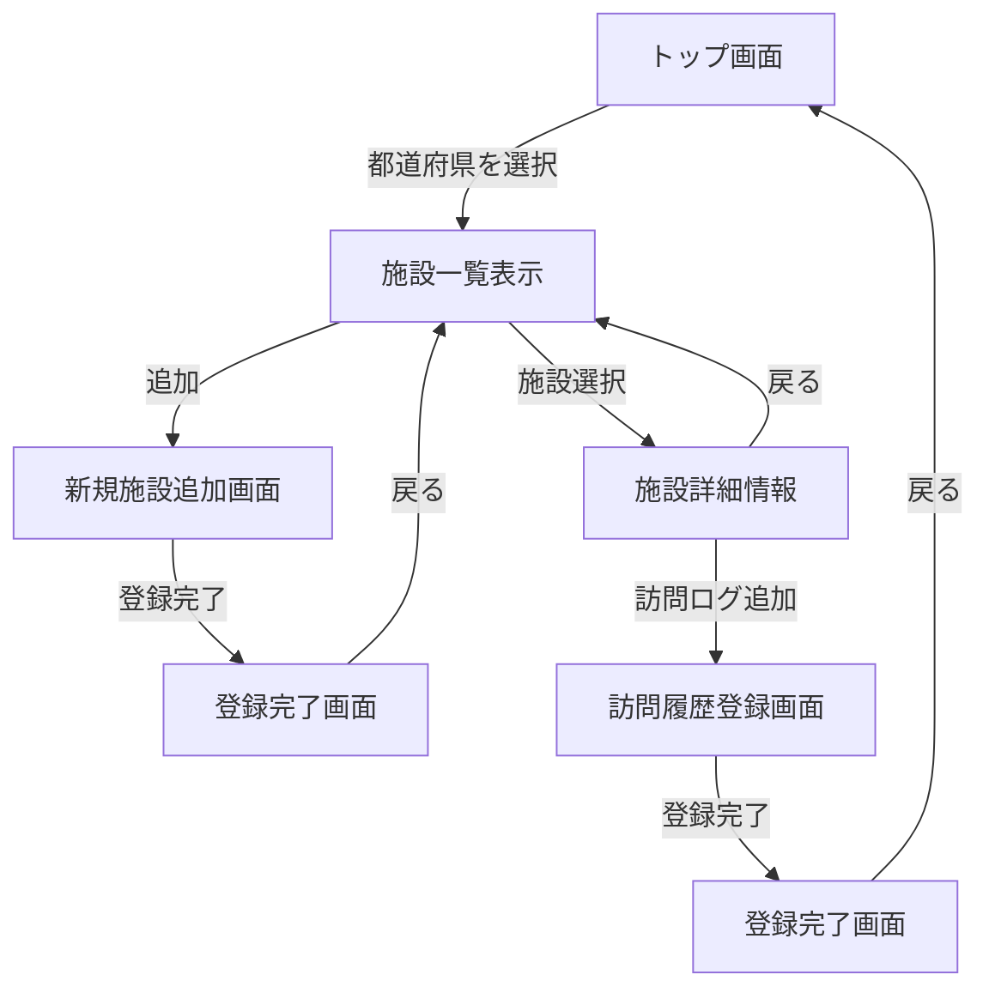

## 振り返り
* **進捗**
    * トップ画面
    * 施設一覧表示
    * 施設詳細画面
    * 訪問ログ追加画面
* **調査した内容**
* **悩み疑問,課題**
    * 現状、トップ画面のどの都道府県を選択しても施設が一覧表示される。
    * テストユーザーは登録されているユーザーからランダムに選択されている。
    * 遷移機能しか追加されていないページがある
    * 施設の初期データが二件しかない
* **学習した内容**
    * ページ遷移の仕方
    * ページ遷移図の書き方
    * urlパラメータが文字列型になること
* **設計**
* **仕様**